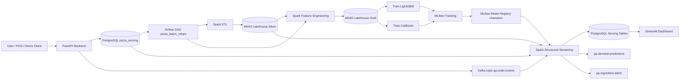
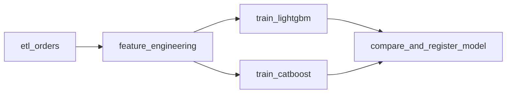

# Pizza Pulse - All In One MLOps Report

Tài liệu này tổng hợp toàn bộ luồng MLOps của project Pizza Pulse để dùng làm nội dung slide báo cáo và demo bài tập lớn.

## 1. Mục tiêu project

Pizza Pulse là hệ thống MLOps chạy trên Kubernetes cho bài toán phân tích và dự đoán nhu cầu bán pizza theo thời gian thực.

Project giải quyết 2 luồng chính:

1. **Batch/offline MLOps**: lấy dữ liệu lịch sử từ PostgreSQL, ETL bằng Spark, tạo feature, train nhiều candidate model, tracking bằng MLflow, chọn champion model và đăng ký vào MLflow Model Registry.
2. **Online/realtime serving**: backend nhận order mới, ghi PostgreSQL, publish Kafka event, Spark Structured Streaming tính feature realtime, load champion model từ MLflow, dự đoán nhu cầu pizza trong giờ tiếp theo, cảnh báo rủi ro nguyên liệu và ghi kết quả về PostgreSQL để dashboard Streamlit hiển thị.

## 2. Kiến trúc tổng thể



## 3. Công nghệ sử dụng

| Thành phần | Công nghệ | Vai trò |
| --- | --- | --- |
| Orchestration | Airflow | Điều phối batch MLOps DAG |
| Distributed compute | Spark Operator + Spark 3.5 | Chạy ETL, feature engineering, streaming inference trên K8s |
| Database | PostgreSQL | OLTP orders, serving tables, metadata DB cho Airflow/MLflow |
| Object storage | MinIO | Lakehouse Parquet, MLflow artifacts, streaming checkpoint |
| Message queue | Strimzi Kafka | Event bus cho order, prediction, ingredient alert |
| Model tracking | MLflow | Tracking run, metrics, artifacts, model registry |
| Backend | FastAPI | API nhận order, ghi DB, bắn Kafka |
| Realtime dashboard | Streamlit | Hiển thị prediction, cảnh báo nguyên liệu, actual online demand |
| Deployment | Helm + Kubernetes YAML | Deploy toàn bộ hệ thống trên namespace `pizza-pulse` |

## 4. Repository layout

| Folder/file | Nội dung |
| --- | --- |
| `sql/schema.sql` | Schema PostgreSQL chính |
| `dataset/pizza_sales.csv` | Dataset mẫu lịch sử |
| `jobs/bootstrap_pizza_db/` | Job bootstrap dữ liệu ban đầu từ CSV vào PostgreSQL |
| `jobs/batch_pipeline/` | Offline batch ETL, feature engineering, train model, compare/register |
| `jobs/streaming_pipeline/` | Spark Structured Streaming inference |
| `airflow/dags/` | Airflow DAGs: bootstrap DB, batch MLOps |
| `spark-apps/` | SparkApplication manifests cho Spark Operator |
| `services/pizza_backend/` | FastAPI backend |
| `services/dashboard/` | Streamlit dashboard |
| `helm-value/` | Helm values và Kubernetes manifests |
| `scripts/` | Script port-forward và client demo backend |

## 5. Database schema chính

### Bảng transactional và catalog

| Bảng | Vai trò |
| --- | --- |
| `orders` | Header đơn hàng: `order_id`, `order_ts` |
| `pizza` | Danh mục pizza: `pizza_id`, `pizza_name`, `pizza_size`, `pizza_category`, `unit_price` |
| `order_items` | Chi tiết từng dòng order: pizza, quantity, unit price, total price |
| `ingredients` | Danh mục nguyên liệu và tồn kho hiện tại `current_stock` |
| `pizza_ingredients` | Mapping pizza -> ingredient, kèm `unit_amount` |

### Bảng realtime serving

| Bảng | Vai trò |
| --- | --- |
| `online_hourly_demand` | Actual demand realtime đã aggregate theo `order_hour` và `pizza_id` |
| `demand_predictions` | Dự đoán số lượng pizza sẽ bán trong `target_hour` |
| `ingredient_risk_predictions` | Dự đoán mức sử dụng nguyên liệu và cảnh báo tồn kho |

## 6. Bootstrap dữ liệu ban đầu

Bootstrap dùng DAG `bootstrap_pizza_db` và SparkApplication `bootstrap-pizza-db.yaml`.

Input:

- `s3a://pp-lakehouse/bronze/raw/pizza_sales.csv`

Job:

- Đọc CSV từ MinIO.
- Parse `order_date` + `order_time` thành `order_ts`.
- Chuẩn hóa dữ liệu thành `orders`, `pizza`, `order_items`.
- Tách `pizza_ingredients` thành danh sách ingredient.
- Insert `ingredients` và mapping `pizza_ingredients`.
- Truncate bảng trước khi load để rerun deterministic.

Image:

- `thaihoc285/ppbootstrap-pizza-db:0.0.1`

## 7. Batch/offline MLOps pipeline

DAG chính: `pizza_batch_mlops`

Schedule hiện tại:

- `schedule=None`, chạy thủ công trong Airflow.
- Có thể đổi sang daily/weekly/monthly tùy kịch bản báo cáo.

Task dependency:



### Task 1: `etl_orders`

File:

- `jobs/batch_pipeline/etl_orders.py`
- SparkApplication: `spark-apps/pizza-batch-etl.yaml`

Input:

- PostgreSQL tables: `orders`, `order_items`, `pizza`

Logic:

- Join order header, line item và pizza catalog.
- Tạo `order_hour`, `order_date`, `hour`, `day_of_week`, `day_of_month`, `month`.
- Tạo `pizza_family` từ `pizza_id`.
- Aggregate hourly demand theo pizza.

Output lakehouse:

- `s3a://pp-lakehouse/silver/order_line_items`
- `s3a://pp-lakehouse/silver/hourly_demand`

### Task 2: `feature_engineering`

File:

- `jobs/batch_pipeline/feature_engineering.py`
- SparkApplication: `spark-apps/pizza-batch-features.yaml`

Input:

- `s3a://pp-lakehouse/silver/hourly_demand`

Logic:

- Tạo dense hourly grid: mọi pizza x mọi giờ trong khoảng dữ liệu.
- Fill giờ không bán bằng `quantity = 0`.
- Tạo calendar features, seasonality features, holiday features, pizza context features.
- Tạo lag/window features theo từng pizza.
- Tạo target: `target_quantity = quantity`.

Output:

- `s3a://pp-lakehouse/gold/demand_features`

Config đáng nói:

- `MAX_FEATURE_LOOKBACK_DAYS=730`
- `PIPELINE_TIMEZONE=Asia/Ho_Chi_Minh`

### Task 3: `train_lightgbm` và `train_catboost`

File:

- `jobs/batch_pipeline/train_candidate_model.py`

Chạy bằng:

- KubernetesPodOperator trong Airflow.
- Image: `thaihoc285/ppbatch-pipeline:0.0.1`

Input:

- Gold features trong MinIO: `s3a://pp-lakehouse/gold/demand_features`

Candidate models:

- LightGBM: `LGBMRegressor`
- CatBoost: `CatBoostRegressor`

Training flow:

- Đọc Parquet từ MinIO bằng PyArrow S3 filesystem.
- Sort theo `order_hour`, `pizza_id`.
- Time-based split theo `TRAIN_SPLIT_FRACTION`, mặc định `0.8`.
- Bỏ các dòng đầu chưa đủ history theo `MIN_HISTORY_HOURS=168`.
- Giới hạn training rows bằng `MAX_TRAINING_ROWS=500000`.
- One-hot encode categorical features.
- Numeric passthrough.
- Train regression model dự đoán số lượng pizza theo giờ.

Metrics:

- `validation_rmse`
- `validation_mae`
- `validation_wmape`

MLflow logging:

- Experiment: `pizza-pulse-batch`
- Tags: `pipeline_step=candidate_train`, `batch_run_tag`, `candidate_model`
- Params: model name, model flavor, train rows, validation rows, feature count, feature list
- Artifacts:
  - MLflow sklearn model
  - Validation predictions CSV
  - Feature importance CSV nếu model hỗ trợ

### Task 4: `compare_and_register_model`

File:

- `jobs/batch_pipeline/compare_and_register_model.py`

Vai trò:

- Tìm các candidate run đã FINISHED trong cùng `BATCH_RUN_TAG`.
- Chọn model tốt nhất theo `MODEL_SELECTION_METRIC=validation_rmse`.
- So sánh với champion hiện tại trong MLflow Registry.
- Register model mới vào model name `pizza_hourly_demand`.
- Nếu tốt hơn hoặc chưa có champion, gán alias `champion` cho version mới.

Model Registry:

- Registered model: `pizza_hourly_demand`
- Alias serving: `champion`
- Model URI streaming dùng: `models:/pizza_hourly_demand@champion`

Promotion logic:

- Nếu chưa có champion: promote.
- Nếu có champion: promote khi candidate metric <= champion metric * `(1 - MIN_MODEL_IMPROVEMENT)`.
- Mặc định `MIN_MODEL_IMPROVEMENT=0.0`, nghĩa là candidate chỉ cần bằng hoặc tốt hơn champion.

## 8. Feature contract

Batch và streaming dùng cùng feature contract để tránh training-serving skew.

File batch:

- `jobs/batch_pipeline/feature_contract.py`

File streaming:

- `jobs/streaming_pipeline/realtime_contracts.py`

Test đảm bảo contract khớp:

- `tests/streaming_pipeline/test_realtime_contracts.py`

Target:

- `target_quantity`

### Integer features

| Feature | Ý nghĩa |
| --- | --- |
| `hour` | Giờ trong ngày |
| `day_of_week` | Thứ trong tuần |
| `day_of_month` | Ngày trong tháng |
| `month` | Tháng |
| `year` | Năm |
| `is_weekend` | Có phải cuối tuần không |
| `is_open_hour` | Có nằm trong giờ mở cửa không |
| `is_lunch_peak` | Khung trưa |
| `is_dinner_peak` | Khung tối |
| `is_peak_hour` | Giờ cao điểm |
| `is_holiday` | Có phải ngày lễ không |
| `is_major_holiday` | Có phải ngày lễ lớn không |

### Double features

| Nhóm | Feature |
| --- | --- |
| Trend/time | `years_since_2015`, `annual_growth_factor` |
| Seasonality | `month_factor`, `weekday_factor`, `hour_weight` |
| Holiday prior | `holiday_mean_units` |
| Demand prior | `daily_demand_prior`, `hour_demand_prior`, `pizza_hour_demand_prior` |
| Product/price | `unit_price`, `pizza_base_weight`, `pizza_context_weight`, `pizza_context_share` |
| Cyclical encoding | `hour_sin`, `hour_cos`, `dow_sin`, `dow_cos`, `month_sin`, `month_cos` |
| Lag | `lag_1h`, `lag_24h`, `lag_168h` |
| Rolling window | `rolling_mean_24h`, `rolling_sum_24h`, `rolling_mean_168h`, `rolling_sum_168h` |

### Categorical features

| Feature | Ý nghĩa |
| --- | --- |
| `pizza_id` | Mã pizza cụ thể |
| `pizza_size` | Size: S/M/L/XL/XXL |
| `pizza_category` | Nhóm pizza: Classic, Chicken, Supreme, Veggie |
| `pizza_family` | Family trích từ `pizza_id` |
| `holiday_name` | Tên ngày lễ hoặc `none` |
| `daypart` | `closed`, `lunch`, `dinner`, `late`, `afternoon`, `open` |

## 9. Online backend

Service:

- `services/pizza_backend/`
- API framework: FastAPI
- Deployment: `helm-value/backend.yaml`
- Image: `thaihoc285/pp-backend:0.0.1`
- Replicas: `2`

Endpoints:

| Endpoint | Vai trò |
| --- | --- |
| `GET /healthz` | Health check |
| `GET /pizzas` | Lấy pizza catalog từ PostgreSQL |
| `POST /orders` | Nhận order, normalize, ghi DB, publish Kafka |

Luồng `POST /orders`:

1. Nhận JSON order.
2. Normalize dữ liệu: sinh `order_id`, `order_ts`, `order_details_id`, `total_price` nếu thiếu.
3. Ghi `orders` và `order_items` vào PostgreSQL.
4. Upsert pizza snapshot nếu order có metadata pizza.
5. Trừ `ingredients.current_stock` dựa trên `pizza_ingredients.unit_amount`.
6. Publish Kafka event vào topic `pp.order.events`.

Kafka event type:

- `order_created`

Topic:

- `pp.order.events`

Điểm kỹ thuật:

- Kafka producer bật `acks=all` và `enable.idempotence=True`.
- PostgreSQL writer dùng `pg_advisory_xact_lock` theo `order_details_id` để tránh retry làm trừ kho sai.
- Có thể disable ghi DB bằng `POSTGRES_WRITE_ENABLED=false` hoặc query param `?persist_postgres=false`.

## 10. Kafka topics

File:

- `helm-value/KafkaTopic.yaml`

| Topic | Producer | Consumer/Use case |
| --- | --- | --- |
| `pp.order.events` | FastAPI backend | Spark Structured Streaming đọc order mới |
| `pp.demand.predictions` | Spark streaming | Kafka UI / downstream service xem prediction event |
| `pp.ingredient.alerts` | Spark streaming | Kafka UI / downstream alerting xem cảnh báo nguyên liệu |

Cấu hình topic:

- Partitions: `3`
- Replicas: `3`
- Retention: `86400000 ms` tương đương 1 ngày
- Retention bytes: `1073741824`

## 11. Streaming inference

File:

- `jobs/streaming_pipeline/pizza_streaming_inference.py`
- SparkApplication: `spark-apps/pizza-streaming-inference.yaml`
- Image: `thaihoc285/ppstreaming-pipeline:0.0.1`

Runtime:

- Spark Structured Streaming đọc Kafka topic `pp.order.events`.
- Trigger: `15 seconds`.
- Checkpoint: `s3a://pp-spark-checkpoints/pizza-streaming-inference`.
- Restart policy: `Always`.

Input:

- Kafka order events.
- PostgreSQL catalog và recent online orders.
- Silver historical hourly demand từ MinIO.
- Champion model từ MLflow.

Processing trong mỗi micro-batch:

1. Parse JSON event theo schema `ORDER_EVENT_SCHEMA`.
2. Filter `event_type = order_created`.
3. Explode `order.items` thành line items.
4. Recompute `online_hourly_demand` cho các cặp `(order_hour, pizza_id)` bị ảnh hưởng.
5. Tạo `target_hour = order_hour + 1 hour`.
6. Cross join target hours với toàn bộ pizza catalog.
7. Tạo feature realtime giống batch:
   - Calendar/holiday.
   - Pizza context.
   - Lag 1h/24h/168h.
   - Rolling 24h/168h.
8. Load model champion từ MLflow Registry.
9. Predict `predicted_quantity` cho từng pizza trong target hour.
10. Ghi/upsert `demand_predictions`.
11. Tính `ingredient_risk_predictions`.
12. Publish prediction events và ingredient alert events về Kafka.

### Model cache trong streaming

Class:

- `ChampionModelCache`

Cơ chế:

- Load model từ `models:/pizza_hourly_demand@champion`.
- Kiểm tra alias version mỗi `MODEL_REFRESH_SECONDS=60`.
- Nếu champion alias đổi sang version mới, streaming tự reload model.
- Giúp deploy model mới không cần restart Spark streaming job.

### Realtime feature history

Streaming kết hợp 2 nguồn lịch sử:

1. Historical batch lakehouse: `s3a://pp-lakehouse/silver/hourly_demand`.
2. Online orders mới nhất từ PostgreSQL.

Mục đích:

- Lag/rolling features không bị thiếu khi vừa có order realtime.
- Prediction giờ tiếp theo dùng cả lịch sử cũ và tín hiệu online mới nhất.

## 12. Serving output

### `online_hourly_demand`

Lưu actual demand realtime theo giờ và pizza:

- `order_hour`
- `pizza_id`
- `quantity`
- `revenue`
- `order_count`
- `last_event_ts`

### `demand_predictions`

Lưu prediction theo target hour và pizza:

- `target_hour`
- `pizza_id`, `pizza_name`, `pizza_size`, `pizza_category`
- `predicted_quantity`
- `model_name`
- `model_alias`
- `model_version`
- `predicted_at`
- `feature_json`

### `ingredient_risk_predictions`

Tính từ prediction và mapping pizza-ingredient:

- `predicted_usage = predicted_quantity * unit_amount`
- `projected_stock = current_stock - predicted_usage`
- `severity`:
  - `critical`: projected stock < 0
  - `warning`: predicted usage >= 80% current stock
  - `ok`: còn lại

## 13. Dashboard realtime

Service:

- `services/dashboard/`
- Framework: Streamlit
- Deployment: `helm-value/dashboard.yaml`
- Image: `thaihoc285/pp-dashboard:0.0.1`
- Refresh: `DASHBOARD_REFRESH_SECONDS=5`

Dashboard đọc 3 bảng PostgreSQL:

- `demand_predictions`
- `ingredient_risk_predictions`
- `online_hourly_demand`

Các section chính:

1. Metrics tổng quan:
   - Prediction rows.
   - Latest model version.
   - Latest prediction timestamp.
2. Demand Predictions:
   - Bar chart prediction top rows.
   - Dataframe chi tiết prediction.
3. Ingredient Risk:
   - Danh sách nguy cơ hết nguyên liệu.
   - Sắp xếp ưu tiên `critical`, `warning`, `ok`.
4. Online Actual Demand:
   - Actual demand realtime đã aggregate từ orders.

## 14. Kubernetes deployment

Namespace:

- `pizza-pulse`

Helm releases:

- `pp-postgre`
- `pp-minio`
- `pp-spark-operator`
- `pp-strimzi`
- `pp-kafka-ui`
- `pp-mlflow`
- `pp-airflow`

Kubernetes manifests:

- `backend.yaml`
- `dashboard.yaml`
- `Kafka.yaml`
- `KafkaTopic.yaml`
- `airflow-rbac-spark.yaml`
- `spark-apps/*.yaml`

MinIO buckets:

| Bucket | Vai trò |
| --- | --- |
| `pp-lakehouse` | Bronze/Silver/Gold Parquet data |
| `pp-mlflow-artifacts` | MLflow model/artifact storage |
| `pp-spark-checkpoints` | Structured Streaming checkpoint |

PostgreSQL databases:

| DB | Vai trò |
| --- | --- |
| `pizza_serving` | Dữ liệu pizza, order, realtime serving |
| `mlflow` | MLflow backend store |
| `airflow` | Airflow metadata DB |

## 15. Demo flow đề xuất

### Trước demo

1. Port-forward services:
   - Airflow: `http://localhost:8080`
   - MLflow: `http://localhost:5000`
   - Kafka UI: `http://localhost:8082`
   - Backend: `http://localhost:8083`
   - Dashboard: `http://localhost:8501`
2. Kiểm tra PostgreSQL, MinIO, Kafka, MLflow, Airflow đã chạy.
3. Upload `pizza_sales.csv` vào `s3a://pp-lakehouse/bronze/raw/pizza_sales.csv`.
4. Chạy DAG `bootstrap_pizza_db` nếu database chưa có dữ liệu.
5. Chạy DAG `pizza_batch_mlops` để tạo champion model.
6. Deploy Spark streaming inference.
7. Deploy backend và dashboard.

### Demo batch MLOps

1. Mở Airflow DAG `pizza_batch_mlops`.
2. Trigger DAG.
3. Show các task:
   - ETL orders.
   - Feature engineering.
   - Train LightGBM.
   - Train CatBoost.
   - Compare and register model.
4. Mở MLflow experiment `pizza-pulse-batch`.
5. Show candidate runs, metrics RMSE/MAE/WMAPE.
6. Show registered model `pizza_hourly_demand`.
7. Show alias `champion`.

### Demo online realtime

1. Mở Kafka UI topic `pp.order.events`.
2. Gọi backend:

```bash
scripts/pizza-backend-client.py publish-order --input services/pizza_backend/examples/order.json
```

Hoặc tạo demo orders interactive:

```bash
scripts/pizza-backend-client.py publish-order
```

3. Show order event xuất hiện trong Kafka.
4. Spark streaming consume event.
5. Mở PostgreSQL hoặc dashboard để thấy:
   - `online_hourly_demand` được cập nhật.
   - `demand_predictions` có prediction giờ tiếp theo.
   - `ingredient_risk_predictions` có severity.
6. Mở Kafka UI topic:
   - `pp.demand.predictions`
   - `pp.ingredient.alerts`
7. Show dashboard Streamlit realtime refresh sau vài giây.

## 16. Điểm nhấn kỹ thuật để đưa vào slide

1. **End-to-end MLOps trên Kubernetes**: toàn bộ DB, object storage, Kafka, Spark, Airflow, MLflow, backend, dashboard đều chạy trong K8s.
2. **Lakehouse layout rõ ràng**:
   - Bronze: raw CSV.
   - Silver: cleaned line items và hourly demand.
   - Gold: ML features.
3. **Training-serving consistency**: batch và streaming dùng cùng feature list, có test kiểm tra feature contract.
4. **Model registry có champion alias**: online serving luôn load `models:/pizza_hourly_demand@champion`.
5. **Auto-reload model trong streaming**: khi champion đổi version, streaming cache reload sau 60 giây.
6. **Realtime + batch kết hợp**: streaming dùng cả historical Silver data và online PostgreSQL data để tính lag/rolling features.
7. **Production-like ingestion**: backend vừa ghi OLTP PostgreSQL vừa publish Kafka event.
8. **Inventory risk prediction**: không chỉ dự đoán demand mà còn chuyển prediction thành cảnh báo nguyên liệu.
9. **Observability cho ML**: MLflow lưu metrics, params, artifacts, validation predictions, feature importance.
10. **Realtime dashboard**: dashboard tự refresh và lấy trực tiếp serving tables.

## 17. Slide outline gợi ý

1. Title: Pizza Pulse - Realtime MLOps for Pizza Demand Forecasting.
2. Problem statement: dự đoán nhu cầu pizza và cảnh báo nguyên liệu.
3. System architecture diagram.
4. Data model PostgreSQL.
5. Batch MLOps pipeline trong Airflow.
6. Lakehouse Bronze/Silver/Gold.
7. Feature engineering: calendar, holiday, pizza context, lag, rolling.
8. Model training: LightGBM vs CatBoost.
9. MLflow tracking và model registry.
10. Champion model selection.
11. Online order ingestion: FastAPI + PostgreSQL + Kafka.
12. Spark Structured Streaming inference.
13. Ingredient risk alert.
14. Streamlit realtime dashboard.
15. Kubernetes deployment.
16. Demo script.
17. Kết luận và hướng phát triển.

## 18. Hướng phát triển thêm

- Thêm automated schedule daily/weekly cho `pizza_batch_mlops`.
- Thêm data quality checks trước training.
- Thêm model drift/data drift monitoring.
- Thêm A/B testing hoặc shadow deployment model.
- Thêm alert notification qua Slack/Email khi ingredient severity là `critical`.
- Tối ưu feature store riêng thay vì tự build feature từ lakehouse và PostgreSQL.
- Thêm CI/CD build image và deploy Helm tự động.
- Thêm Grafana/Prometheus để monitor Spark, Kafka, Airflow, MLflow.

## 19. Quick reference

| Item | Giá trị |
| --- | --- |
| Namespace | `pizza-pulse` |
| Batch DAG | `pizza_batch_mlops` |
| Bootstrap DAG | `bootstrap_pizza_db` |
| Batch image | `thaihoc285/ppbatch-pipeline:0.0.1` |
| Streaming image | `thaihoc285/ppstreaming-pipeline:0.0.1` |
| Backend image | `thaihoc285/pp-backend:0.0.1` |
| Dashboard image | `thaihoc285/pp-dashboard:0.0.1` |
| MLflow experiment | `pizza-pulse-batch` |
| Registered model | `pizza_hourly_demand` |
| Serving alias | `champion` |
| Order topic | `pp.order.events` |
| Prediction topic | `pp.demand.predictions` |
| Ingredient alert topic | `pp.ingredient.alerts` |
| Lakehouse root | `s3a://pp-lakehouse` |
| Streaming checkpoint | `s3a://pp-spark-checkpoints/pizza-streaming-inference` |
| PostgreSQL DB | `pizza_serving` |
| Backend local URL | `http://localhost:8083` |
| Dashboard local URL | `http://localhost:8501` |
| MLflow local URL | `http://localhost:5000` |
| Kafka UI local URL | `http://localhost:8082` |
| Airflow local URL | `http://localhost:8080` |
